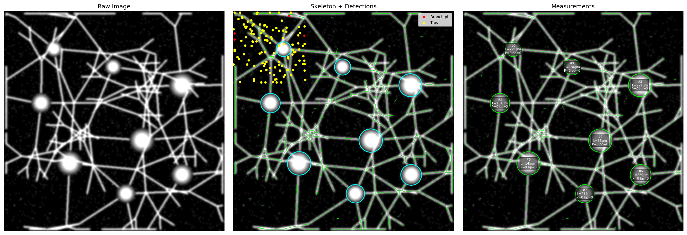

# Neurite Length Analyzer

Automated quantification of neurite morphology from fluorescence microscopy images. Detects soma (cell bodies) and neurites, skeletonizes the neurite network, and outputs per-soma measurements to a CSV.

---

## Example Output



*Left: preprocessed image. Middle: Cellpose soma detection (cyan circles), skeletonized neurites (green), branch points (yellow). Right: per-soma measurements.*

---

## What It Measures

For each detected soma in each image, the script outputs:

| Column | Description |
|---|---|
| `soma_id` | Index of the soma within this image |
| `soma_x`, `soma_y` | Centroid coordinates (pixels) |
| `soma_radius_px` | Estimated soma radius (pixels) |
| `soma_mean_intensity` | Mean fluorescence intensity of the soma |
| `n_primary_neurites` | Branches directly exiting the soma |
| `n_branch_points` | Junctions where a neurite splits into two |
| `n_endpoints` | Tips (free ends) of the neurite tree |
| `n_branches_attributed` | Total skeleton segments assigned to this soma |
| `total_length_um` | Sum of all neurite lengths attributed to this soma (µm) |
| `mean_segment_length_um` | Average length of individual skeleton segments (µm) |
| `max_path_length_um` | Longest path from the soma to any tip (µm) |
| `pixel_size_um` | Pixel size used for calibration |

All length measurements are in **micrometers** and scale correctly when you supply `--pixel-size`.

---

## How It Works

The pipeline runs the following stages on each image:

### 1. Image Loading
Supports TIFF (including 16-bit microscopy TIFFs), PNG, and JPEG. Handles multi-channel images (channel-first or channel-last), and Z-stacks (max-projected over Z automatically).

### 2. Preprocessing
- **Soma channel**: Gaussian blur (σ=1.5) + normalize. No background subtraction — soma are the globally brightest features and rolling-ball would hollow them out.
- **Neurite channel**: Gaussian blur + rolling-ball background subtraction (radius = 2.5× max soma radius) to remove slow illumination gradients while preserving thin structures.

### 3. Soma Detection — Cellpose (ML)
Uses **[Cellpose](https://github.com/MouseLand/cellpose)** (deep learning, `cyto3` model) for instance segmentation of soma. Cellpose was trained on thousands of fluorescence microscopy images and handles:
- Irregular soma shapes
- Varying sizes
- Crowded or touching cells

Falls back to classical Laplacian-of-Gaussian blob detection (`blob_log`) if Cellpose is not installed. Use `--no-cellpose` to force the classical approach.

### 4. Neurite Detection — Frangi Vesselness Filter
Applies the **Frangi filter** (`skimage.filters.frangi`) — a multiscale filter specifically designed for tubular/vessel-like structures. It enhances thin elongated features (neurites) while suppressing blobs (soma) and uniform backgrounds. The output is thresholded to produce a binary neurite mask, from which soma regions are excluded.

### 5. Skeletonization
The binary neurite mask is reduced to a **1-pixel-wide skeleton** (`skimage.morphology.skeletonize`), preserving the topology of the neurite network.

### 6. Skeleton Graph Analysis — skan
**[skan](https://github.com/jni/skan)** (Skeleton Analysis) converts the skeleton image into a branch graph. Each branch gets:
- `branch-distance`: Euclidean arc length in calibrated units
- `branch-type`: endpoint-to-endpoint (isolated), endpoint-to-junction, or junction-to-junction
- Endpoint coordinates

### 7. Soma Attribution — Pixel-wise Voronoi
Each skeleton pixel is assigned to the **nearest soma centroid** (Euclidean distance). This Voronoi partition is done pixel-by-pixel on the skeleton, which avoids the "BFS flooding" problem where a connected skeleton lets one soma claim branches belonging to another. Each soma then gets its own sub-skeleton for independent analysis.

### 8. Measurement
For each soma's sub-skeleton:
- **Primary neurites**: branches with an endpoint inside 2× the soma radius
- **Branch points**: skeleton nodes with degree ≥ 3
- **Endpoints**: skeleton nodes with degree = 1 (neurite tips)
- **Total length**: sum of `branch-distance` for all attributed branches
- **Max path**: longest Dijkstra path from the soma's nearest graph node to any tip (via NetworkX)

### 9. Output
- `output/results.csv` — one row per soma per image
- `output/<image>_analyzed.png` — 3-panel annotated figure (raw | skeleton | measurements)

---

## Installation

```bash
pip install -r requirements.txt
```

**Dependencies:**

| Package | Purpose |
|---|---|
| `scikit-image` | Frangi filter, skeletonization, blob detection |
| `cellpose` | Deep learning soma segmentation |
| `skan` | Skeleton-to-graph conversion and branch measurement |
| `networkx` | Graph traversal for max-path calculation |
| `tifffile` | 16-bit TIFF loading (microscopy standard) |
| `numpy`, `scipy` | Array operations and morphology |
| `pandas` | CSV export |
| `matplotlib` | Visualization |

> **Note**: Cellpose will download a ~1.1 GB model on first run. It is cached at `~/.cellpose/models/`.

---

## Usage

```bash
python3 analyze_neurites.py <image_dir> <output_dir> [options]
```

### Basic example
```bash
python3 analyze_neurites.py ./images ./output
```

### With microscope calibration
```bash
# If your microscope is 0.325 µm/pixel (common for 20× objectives):
python3 analyze_neurites.py ./images ./output --pixel-size 0.325
```

### Tuning detection sensitivity
```bash
# Lower thresholds = more detections (use if missing soma or neurites)
python3 analyze_neurites.py ./images ./output \
    --soma-threshold 0.05 \
    --neurite-threshold 0.003 \
    --min-soma-radius 12 \
    --max-soma-radius 45
```

### Multi-channel images
```bash
# If soma are in channel 0 and neurites in channel 1:
python3 analyze_neurites.py ./images ./output \
    --soma-channel 0 \
    --neurite-channel 1
```

### All options

```
positional arguments:
  image_dir                   Directory containing input images
  output_dir                  Directory for results and annotated images

optional arguments:
  --soma-channel INT           0-indexed channel for soma detection (default: auto/grayscale)
  --neurite-channel INT        0-indexed channel for neurite detection (default: same as soma)
  --pixel-size FLOAT           Micrometers per pixel (default: 1.0)
  --min-soma-radius INT        Minimum soma radius in pixels (default: 10)
  --max-soma-radius INT        Maximum soma radius in pixels (default: 40)
  --soma-threshold FLOAT       blob_log sensitivity, only used without Cellpose (default: 0.1)
  --neurite-threshold FLOAT    Frangi filter binarization threshold (default: 0.01)
  --min-branch-length FLOAT    Discard skeleton branches shorter than this in pixels (default: 10)
  --no-cellpose                Force classical blob_log soma detection
  --no-visualization           Skip saving annotated images (faster for large batches)
  --verbose                    Enable debug logging
```

---

## Input Images

Place your images in a directory (e.g. `images/`). Supported formats:

| Format | Notes |
|---|---|
| `.tif` / `.tiff` | Recommended. Supports 8-bit, 16-bit, multi-channel, Z-stacks |
| `.png` | Good for exported images |
| `.jpg` / `.jpeg` | Supported but lossy compression may reduce accuracy |

**Multi-channel TIFFs**: If your images have separate channels for soma and neurites (common in multi-color experiments), use `--soma-channel` and `--neurite-channel` to specify which channel index to use for each stage.

**Z-stacks**: 4D TIFFs `(Z, C, H, W)` are automatically max-projected over the Z axis before analysis.

---

## Test Images

The `images/` directory contains 3 synthetic fluorescence microscopy images generated for testing. Each is a 16-bit TIFF (512×512 px) with:
- 7–8 neurons, each with a bright circular soma (radius ~20–30 px)
- Branching neurite trees (depth 2, 3–5 primary neurites per soma)
- Gaussian PSF blur (σ=1.5) mimicking optical diffraction
- Low Poisson shot noise

These were generated with NumPy/SciPy to validate the pipeline before real data is available. The same script works without modification on real microscopy data.

### Synthetic test results

| Image | Soma | Avg total length | Avg branch points | Avg endpoints | Avg max path |
|---|---|---|---|---|---|
| `neuron_sample_01.tif` | 8 | 181 µm | 0.5 | 17 | 29 µm |
| `neuron_sample_02.tif` | 8 | 205 µm | 0.3 | 16 | 24 µm |
| `neuron_sample_03.tif` | 7 | 193 µm | 1.0 | 15 | 32 µm |

*(pixel size set to 0.325 µm/px for these runs)*

---

## Tips for Real Data

- **Pixel size**: Check your microscope acquisition software (MetaMorph, µManager, NIS-Elements, etc.) or the TIFF metadata. Common values: 0.16 µm/px (63×), 0.325 µm/px (20×), 0.65 µm/px (10×).
- **Neurite threshold**: Start with the default (`0.01`). If neurites are faint, lower it to `0.003–0.005`. If you're getting too much noise, raise it to `0.02–0.05`.
- **Soma radius**: Measure a few soma manually in ImageJ and set `--min-soma-radius` and `--max-soma-radius` accordingly.
- **Multi-color**: If you have a separate nuclear/soma stain (e.g., DAPI or mCherry soma + GFP neurites), always use `--soma-channel` and `--neurite-channel` for best results. Single-channel GFP images (like the example above) work with the defaults.
- **Dense cultures**: Cellpose handles crowded cells well. If soma are merging, try lowering `--max-soma-radius`.

---

## Project Structure

```
neurite-length/
├── analyze_neurites.py   # Main script — NeuriteAnalyzer class + CLI
├── requirements.txt      # Python dependencies
├── README.md             # This file
├── images/               # Input images (place your TIFFs here)
│   ├── neuron_sample_01.tif
│   ├── neuron_sample_02.tif
│   └── neuron_sample_03.tif
└── output/               # Results (generated by running the script)
    ├── results.csv
    ├── neuron_sample_01_analyzed.png
    ├── neuron_sample_02_analyzed.png
    └── neuron_sample_03_analyzed.png
```
